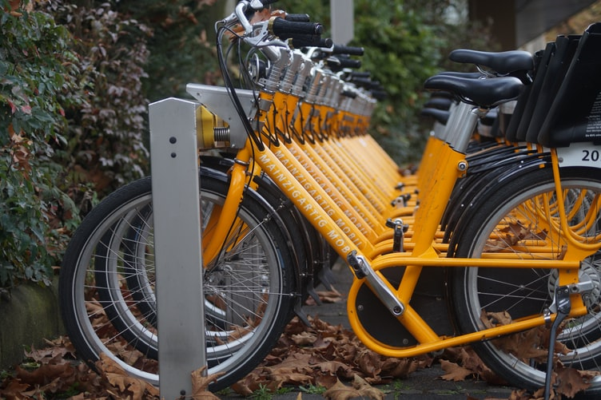
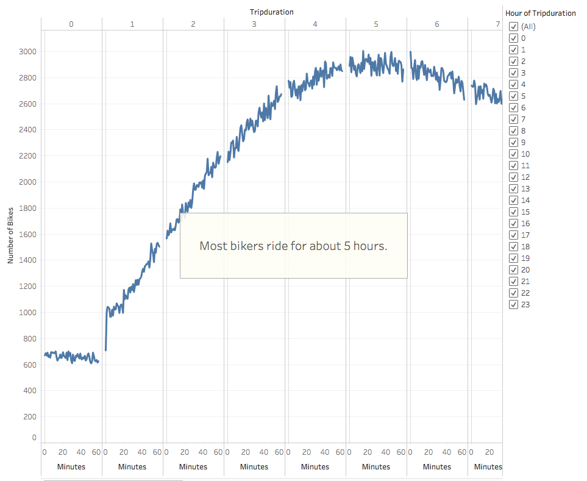
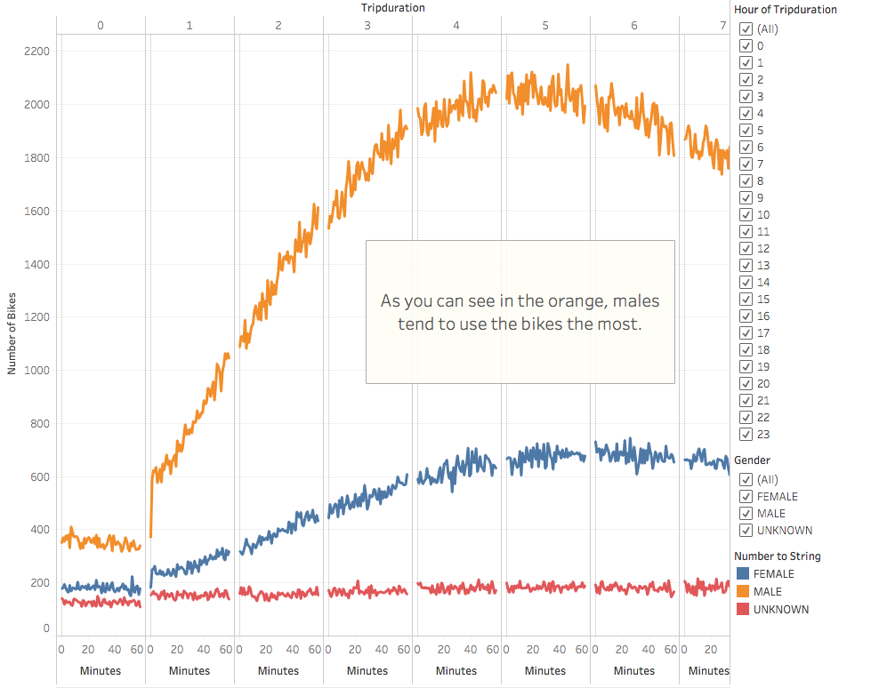
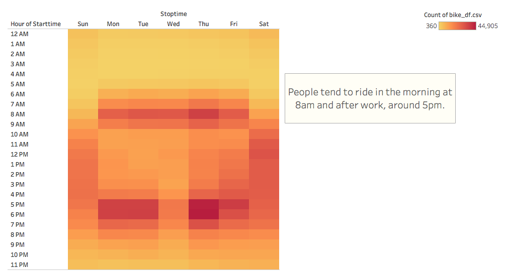
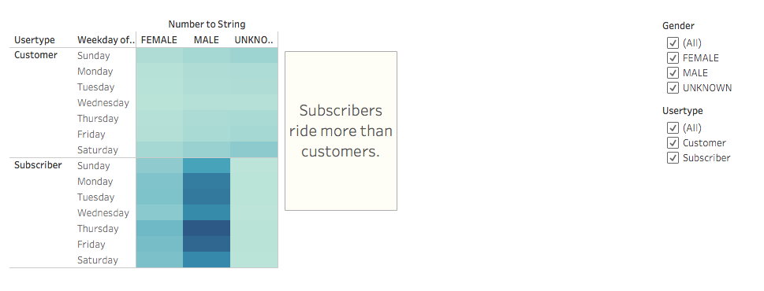
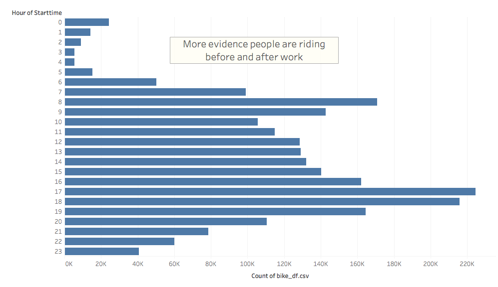
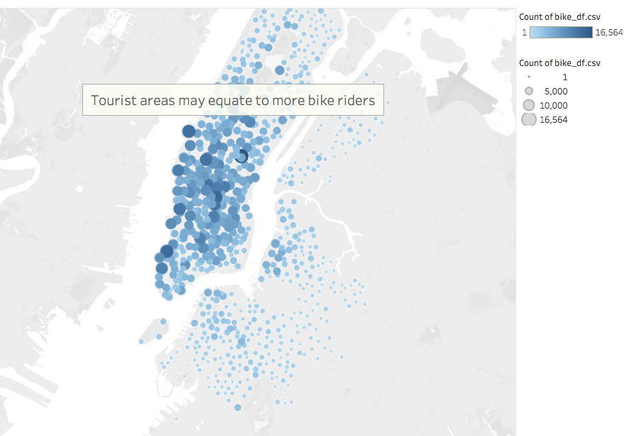

# Bikesharing with Tableau

## Overview of Project:

The purpose of this project was to perform an analysis using Tableau software on the company Citibike's New York City bikesharing data in order to create visualizations of findings to aid in pitching a potentially similar bikesharing business proposal in Des Moines, Iowa to investors.  The analysis process involved downloading a CSV file from the Citybike website, a small amount of converting datatypes and formatting in Python, importing the data into Tableau, and using the Tableau software to create meaningful visualizations about the data.  All of the NYC findings are analyzed below for benchnmarking the business model for the bikesharing startup proposal.

--------------------------------------------
Tableau Public Link:
[Tableau Workbook](https://public.tableau.com/profile/alex.conerly#!/vizhome/CitiBike_16083508459960/Citi_Bike_Story)

---------------------------------------------
## Resources:

Data Sources: 

www.citybikenyc.com: 
201908-citibike-tripdata.csv

Software: 

    Visual Studio Code 1.49.2, Tableau 20.20.3, Python 3.8.3,
    Jupyter Notebook 6.0.3, Pandas 1.0.5

---------------------------------------------

## Results

From the analysis of the New York City bikesharing data, a variety of data relationships were revealed that may warrant as useful benchmarks for devising a similar bikesharing plan in Des Moines.  For instance, the length of time that bikes were checked out for all riders in New York can be seen in the screenshot below.  Specifically, Tableau's visualization demonstrates that most riders in New York tend to ride for about four to six hours at a time.

The same analysis for the length of time bikes were checked out was further investigated among each gender as well.  The following image displays that males are, by far, the most common users.  Even so, we can still see that the female users tended to follow a similar pattern of about five hours of bike riding time.

Next, we investigated the number of bike trips for all riders for each hour of each day of the week.  From this heatmap visualization shown below, we can see that on the weekends, people had a slight tendency to ride in the middle of the day.  However, during the week, there was a higher propensity for customers and subscribers to ride around eight o'clock in the morning as well as about five o'clock in the evening.  Of course, this may be because people are commuting to and from work on bikes.

Likewise, when the same analysis was performed again but with the additional discrepancy for each gender's riding tendencies, the same general results occured for the most popular times of day to ride according to the day of the week.  Although, as stated earlier, most of the bike riders were male, the general riding times were consistent overall among each gender category.

.png)

Furthermore, analysis was conducted to discern the number of bike trips for each type of user (customer or annual subscriber) and gender for each day of the week.  From this visualization provided below, we see that subscribers ride far more than customers overall.  Once again, it is mostly male riders.  However, it's also interesting to note that the highest number of riders occured by male subscribers on Thursdays, followed by Fridays.  On Wednesdays there was a slight dip in the bike riding tendencies from both genders.  The category of "unknown" did not display any obvious relationship, perhaps because the data for this category was quite low overall.

Continuing on, Tableau offered an additional bar graph visualization to see the breakdown of peak riding hours from the dataset.  Once again, we see further evidence that eight o'clock in the morning and approximately five to seven o'clock in the evening is a popular time for bike riding in general.  In contrast, the least popular time for bike riding appears to occur from about two in the morning to five o'clock in the morning.  As such, this may be an efficient time for a bikesharing company to perform bike maintenance work on some of the bikes since during those times the bikes would be in less demand than otherwise.

Finally, in the last visualization we see a map generated from latitudinal and longitudinal coordinates, populated by the count of the data.  The size and color shades of the marked geographical positions are in direct proportion to the number of instances that bike rides were initiated.  Thus, the larger and darker circles indicate a higher amount of bike rides that were started at that particular bike station.  Although further research may be warranted to adequately verify the causation, the high density of bike rides in certain areas may be due to large amounts of tourism as this location is certainly a popular tourism site.  Hence, it may be useful to consider any correlation of tourism to bikesharing propensity if this analysis is to be used to select bike station locations for any potential ridesharing business plan in Des Moines.

## Summary

Overall, the visualizations obtained analyzing New York City's 2019 Citybike bikesharing dataset provided a myriad of interesting insights which may be useful for planning a potential bikesharing business in Des Moines.  For instance, considering most of the riders were annual subscribers it may be advantageous if a comparable business invested its initial advertisement towards obtatining consistent, annual subscribers.  In addition, since tourism may play a large role in bikesharing in New York, any potential comparable startup may choose to begin the majority of its bike stations in the locations with the highest tourism.  Furthermore, given that people tend to ride in the mornings and after work in New York, it may be advantageous for other comparable startups to consider how bikes could play a role in communiting to and from work for the most dense areas in a city.

For further analysis, many other visualizations could be explored from the given dataset.  For instance, the relationship between age and starting point could be compared in order to determine how various age groups may begin their bike journeys.  Suppose, for instance, if people in a younger age range tend to ride to particular areas where young people populate, it could be helpful to know how to market to these areas.  Also, one could explore the relationship between the count of the bike IDs and the count of station IDs to determine how many bikes there are per station.  From analyses such as these, the prospect of creating a comparable startup is far easier to visualize and using a tool like Tableau for this purpose certainly provides invaluable insights for decision making.